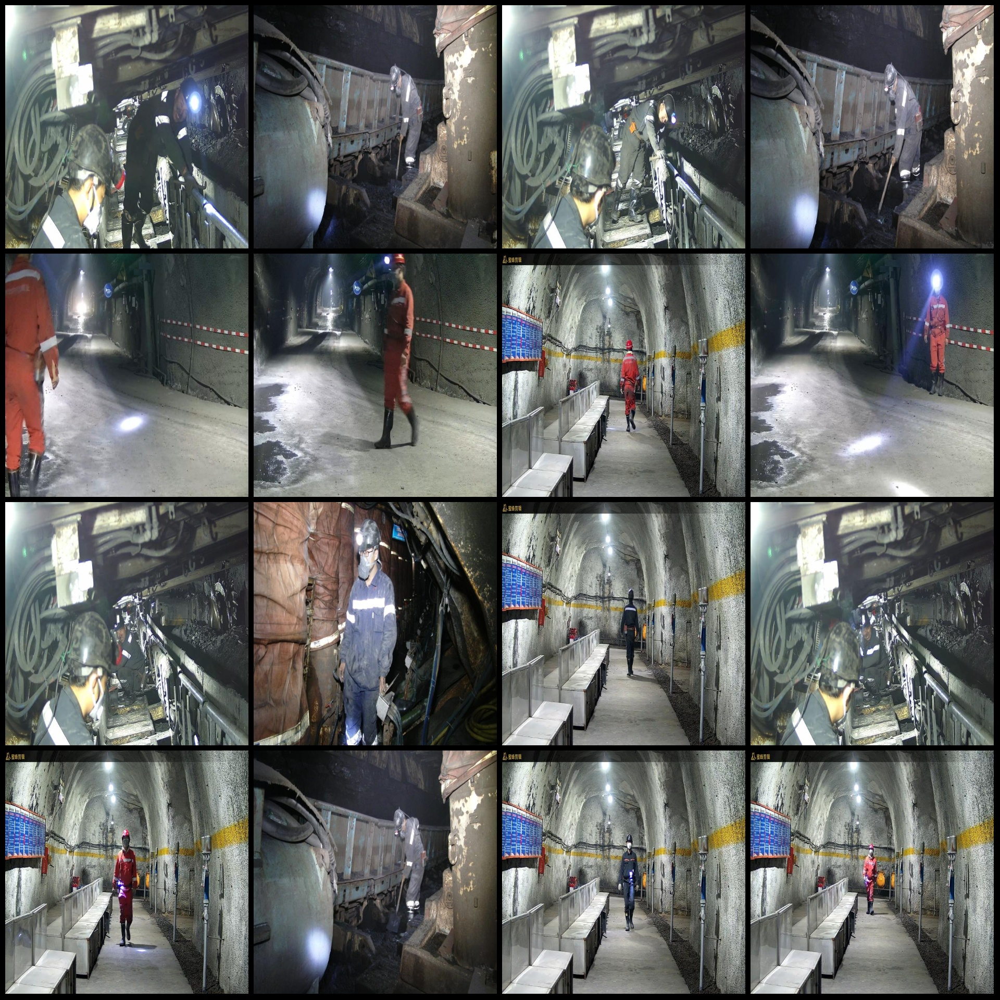
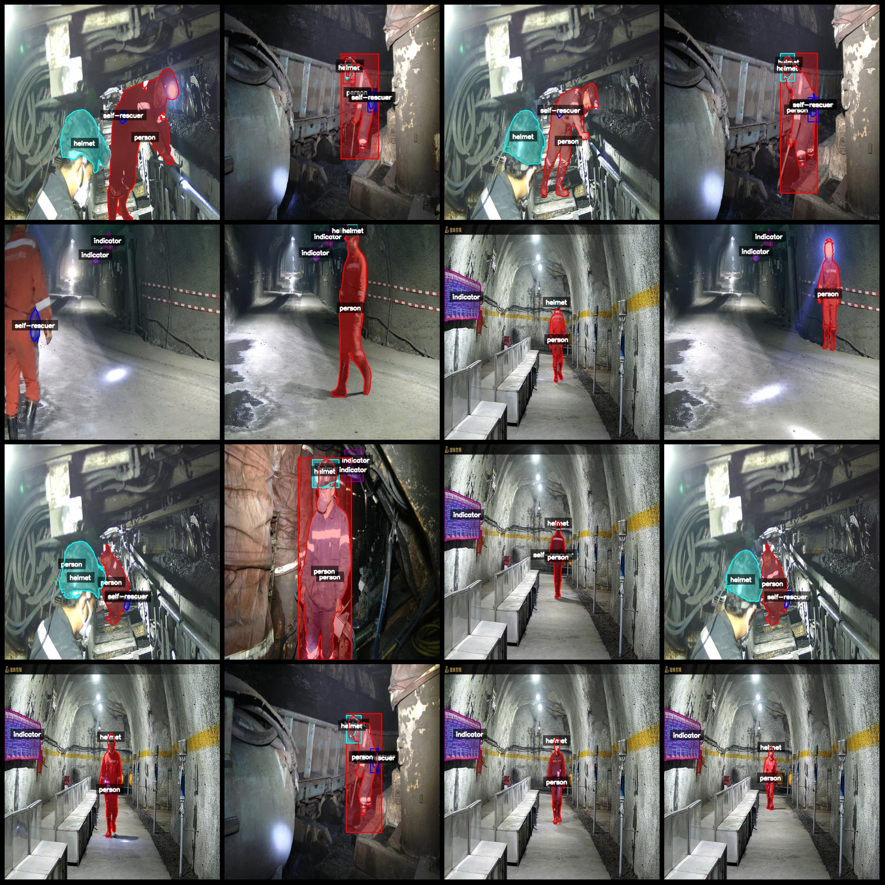
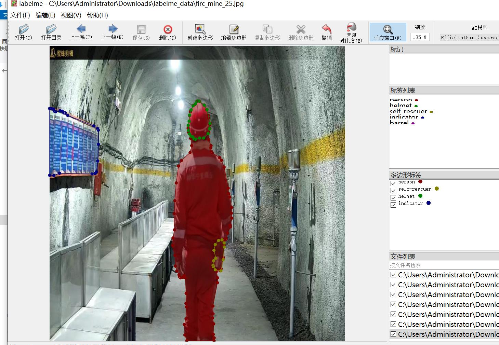

# Smart Mine Safety Helmet Person Emergency Rescuer Identification and Split Data Set - LabelMe Format with 1974 Images and 5 Categories

Dataset format: LabelMe format (without mask files, only including JPG images and corresponding JSON files)
Number of images (JPG file count): 1974
Number of annotations (JSON file count): 1974
Number of annotation categories: 5
Annotation category names: ["person", "helmet", "self-rescuer", "indicator", "barrel"]
Number of boxes per category:
- person (people) count = 2252
- helmet (helmets) count = 1846
- self-rescuer (rescuers) count = 837
- indicator (indicators) count = 2001
- barrel (buckets) count = 36
Total number of boxes: 6972

Annotation tool used: labelme=5.5.0
Image resolution: 640x640
Annotation rules: Polygon box for each category
Important note: This dataset can be opened and edited in LabelMe; the JSON dataset needs to be converted into a mask or YOLOF/COCO format for semantic segmentation or instance segmentation.
Special declaration: This dataset does not guarantee the accuracy of the trained models or weight files.

Picture previews:
Annotation example (randomly selected 16 images):
Annotation drawing results:
LabelMe editing image example:

## Images

Here is a pay link on Stripe ( https://buy.stripe.com/3cs8yP7sY87d0vu9AB ). Please contact me lonlonago@foxmail.com after funding $89, and I will send you a complete data files , thank you!

